 

  

  <h1 align="center">Brain Tumor Segmentation</h1>
  
  

     
    <a href="https://github.com/daoducanhc/Tumor_Segmentation#results">View Demo</a>
    ·
    <a href="https://github.com/daoducanhc/Tumor_Segmentation/issues">Report Bug</a>
    ·
    <a href="https://github.com/daoducanhc/Tumor_Segmentation/issues">Request Feature</a>
  

## About The Project

## Training Process
### UNet
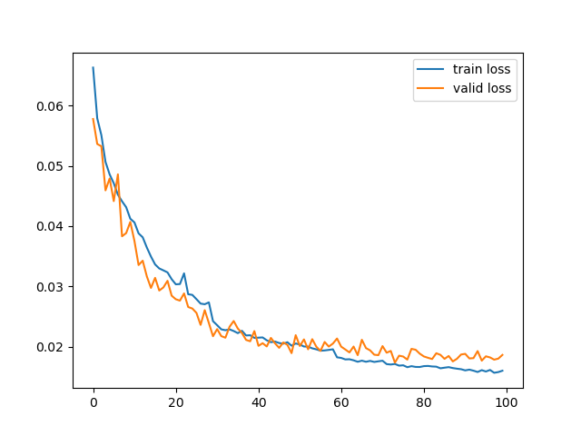

### ResUNet
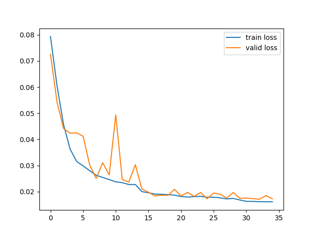

## Results
.                |  UNet        |      ResUNet
:---------------:|:------------:|:----------------:
Mean Dice score  |   0.73       |       **0.76**
Number of epoch  |    100       |       **35**

## Demo
.             |      .
:-------------------------:|:-------------------------:
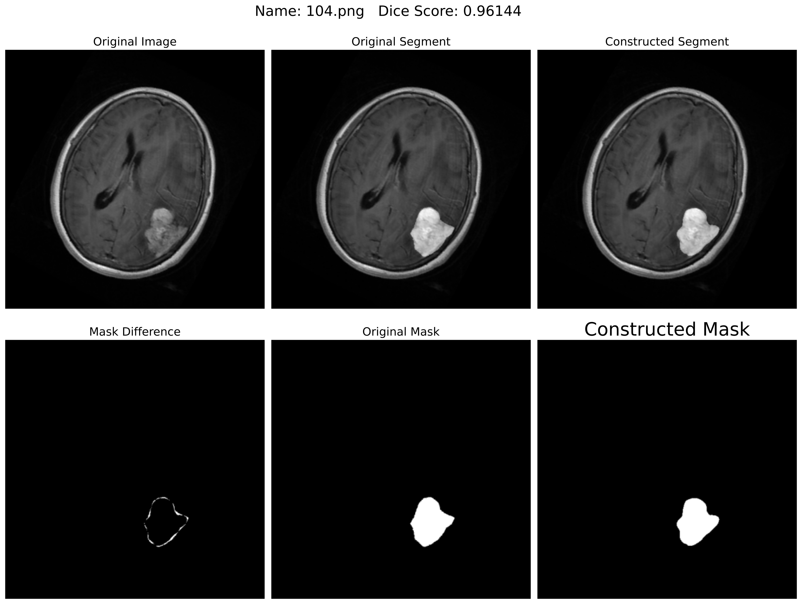  |  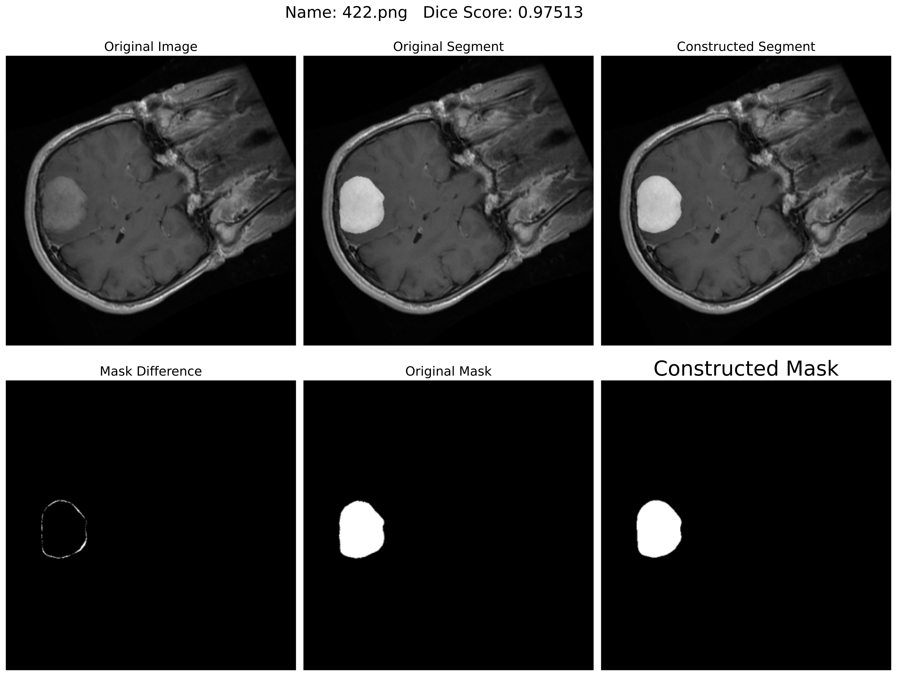
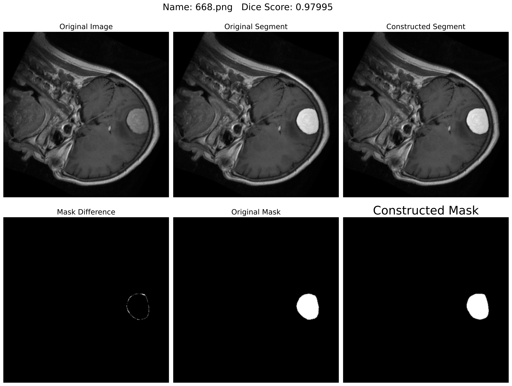  |  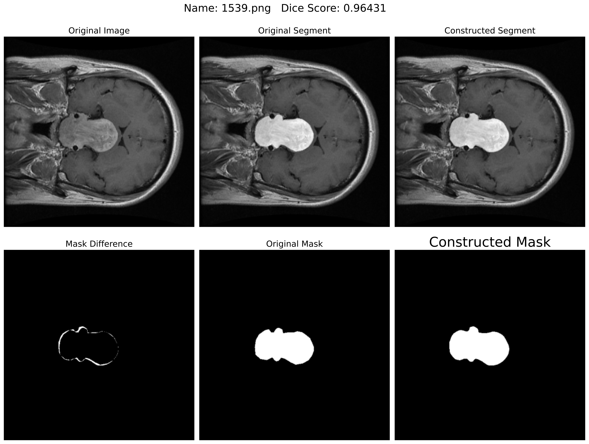
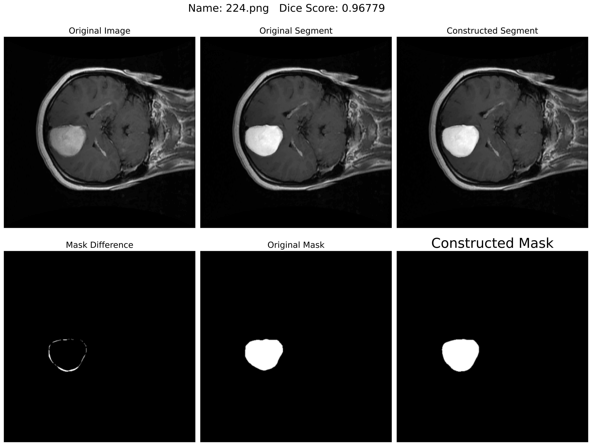  |  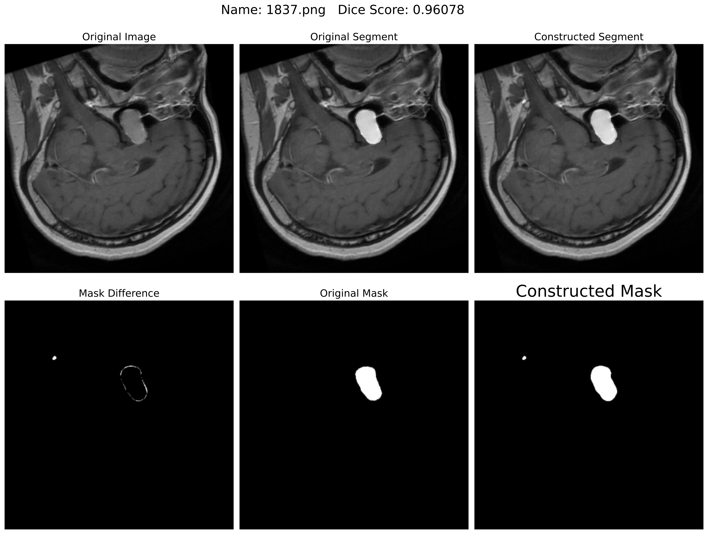
  |  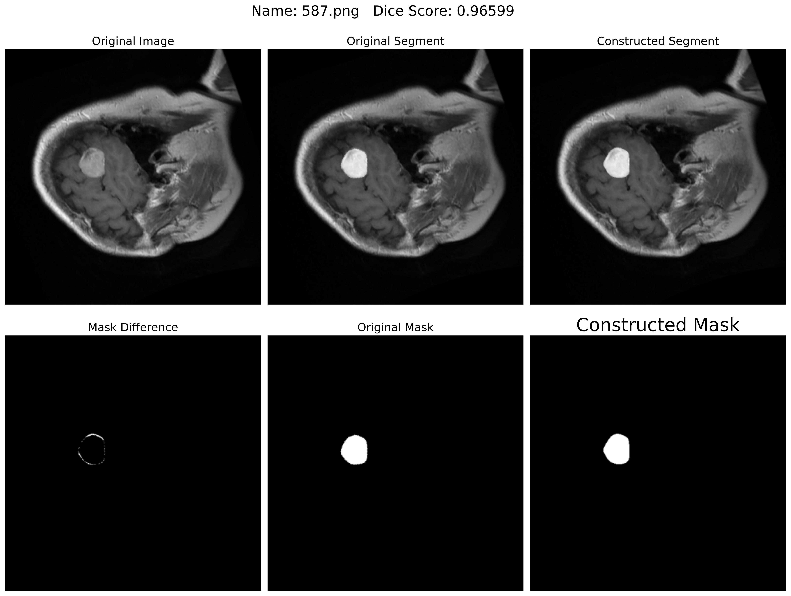
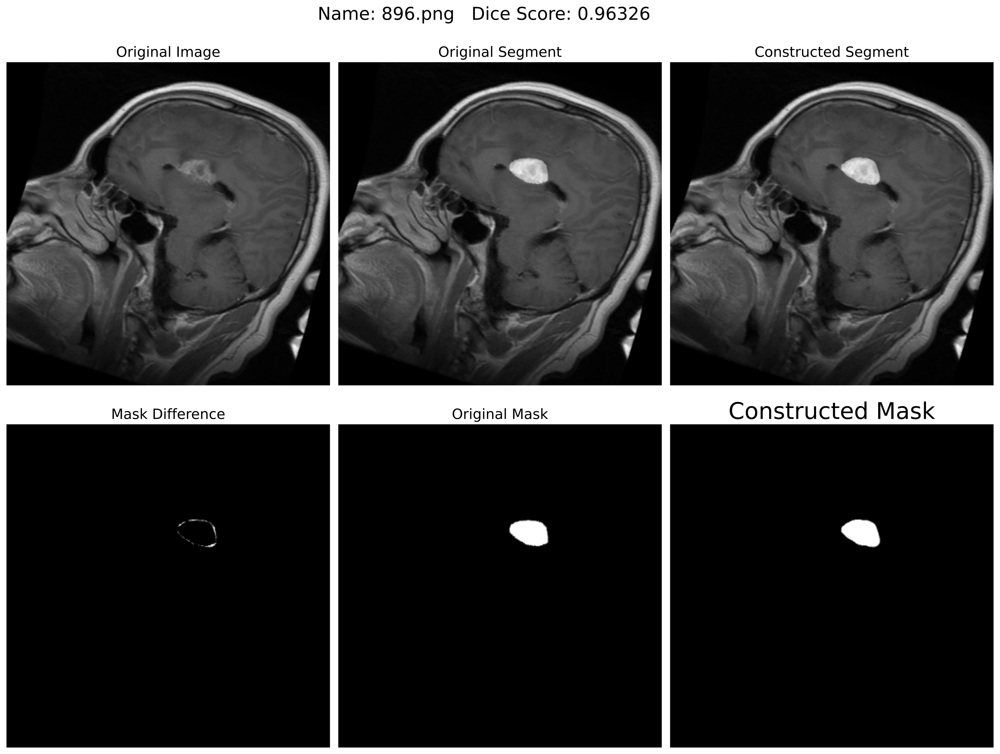  |  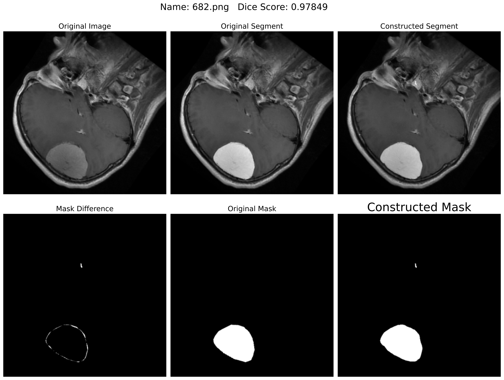
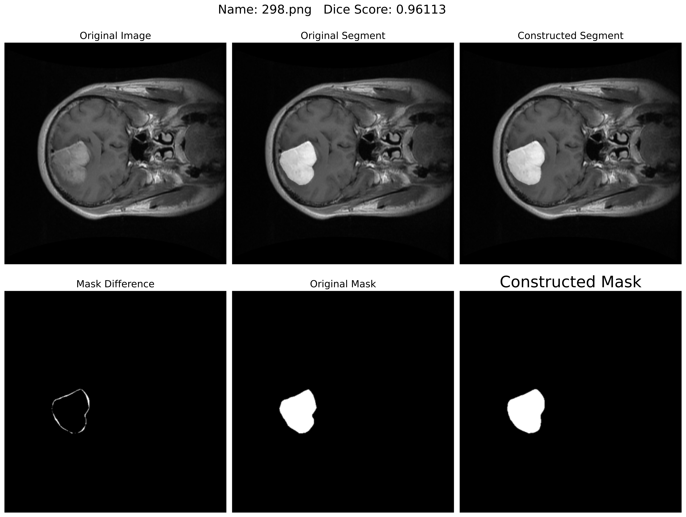  |  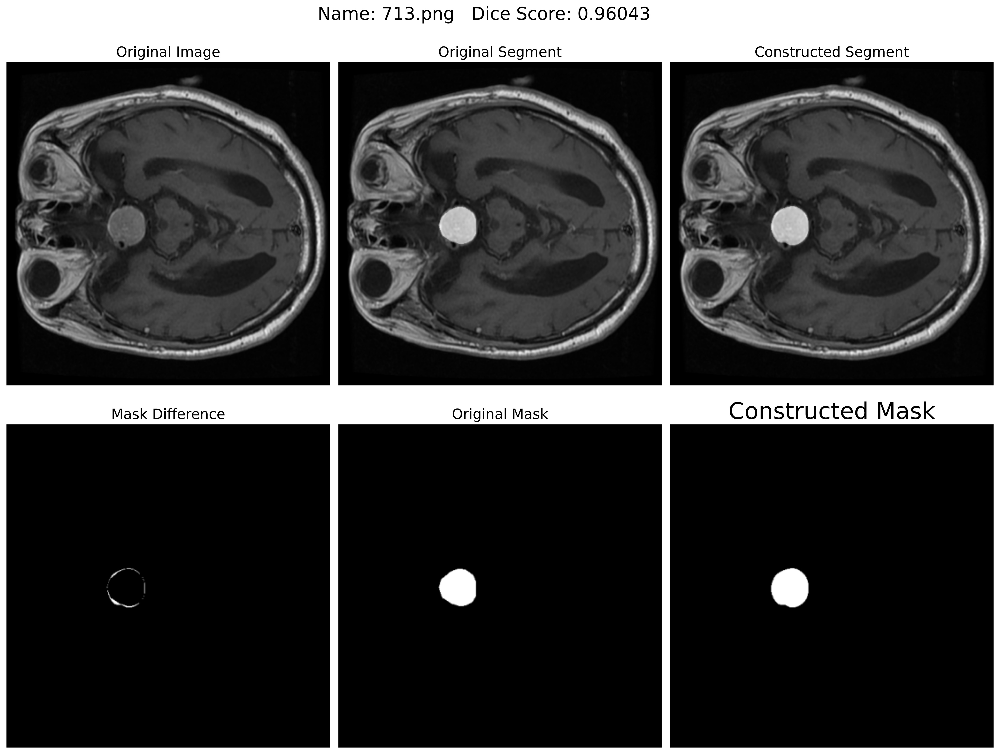
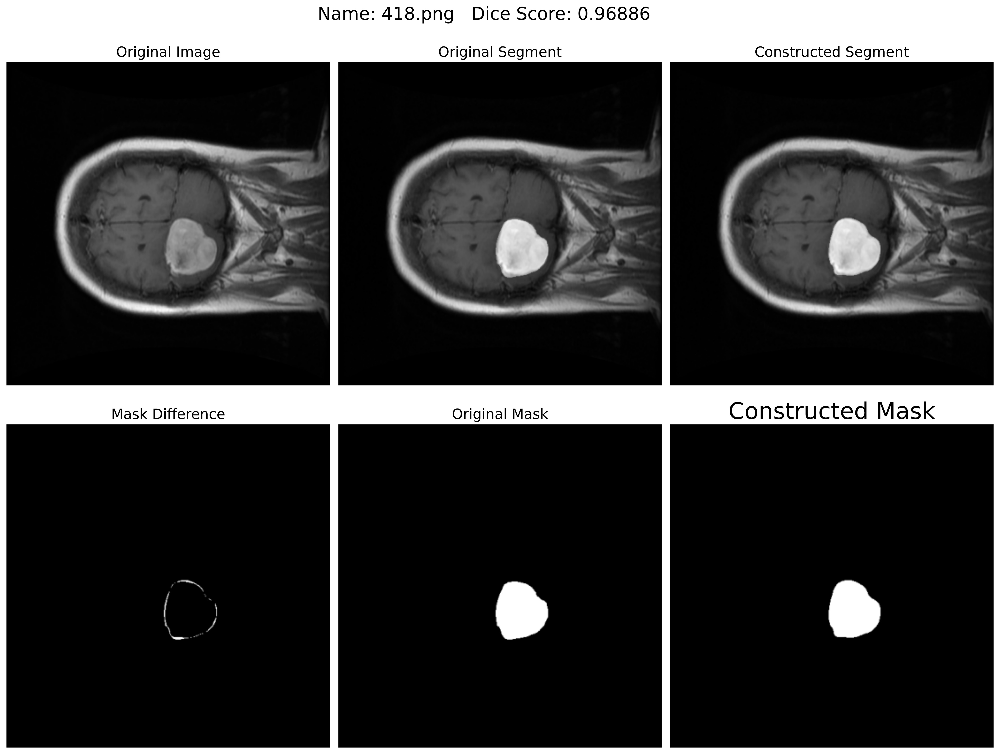  |  
