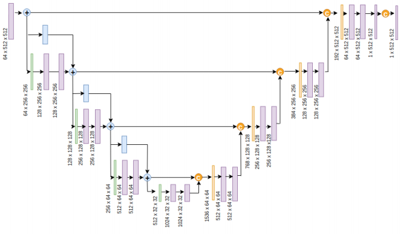
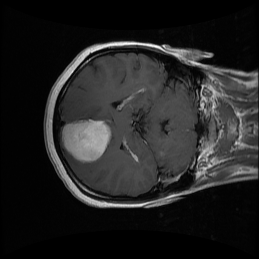
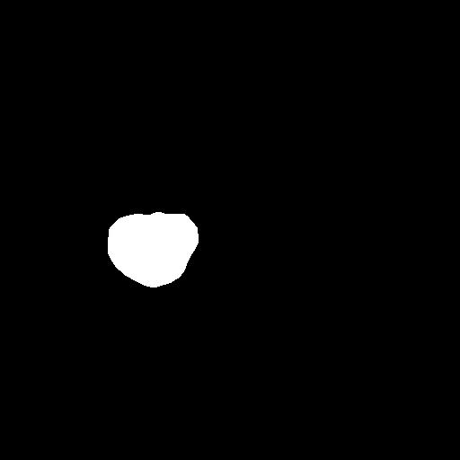
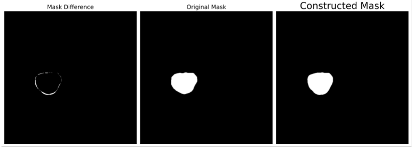
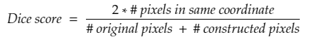

<br />
<p align="center">
  <a href="https://github.com/daoducanhc/Tumor_Segmentation">
    
  </a>

  <h1 align="center">Brain Tumor Segmentation</h1>
  
  <p align="center">
    <br />
    <a href="https://github.com/daoducanhc/Tumor_Segmentation/issues">Report Bug</a>
    ·
    <a href="https://github.com/daoducanhc/Tumor_Segmentation/issues">Request Feature</a>
    .
    <a href="https://github.com/daoducanhc/Tumor_Segmentation#key-results">Results</a>
    ·
    <a href="https://github.com/daoducanhc/Tumor_Segmentation#clapper-demo">Demo</a>
    ·
  </p>
</p>

&nbsp;&nbsp;&nbsp;&nbsp;&nbsp;&nbsp;&nbsp;&nbsp;&nbsp;&nbsp;&nbsp;&nbsp;&nbsp;&nbsp;&nbsp;&nbsp;&nbsp;&nbsp;&nbsp;&nbsp;&nbsp;&nbsp;&nbsp;&nbsp;&nbsp;&nbsp;&nbsp;&nbsp;&nbsp;&nbsp;
[](https://www.python.org/downloads/release/python-383/)
[](https://pytorch.org/get-started/previous-versions/#v170)
[](https://developer.nvidia.com/cuda-11.0-download-archive)
[](https://matplotlib.org/3.3.3/contents.html)
[](https://github.com/daoducanhc/Tumor_Segmentation#balance_scale-license)


## :brain: About The Project
The Brain Tumor Segmentation project utilizes Deep Learning to help doctors in the segmentation process. 

The system is built with PyTorch in order to examine two model architectures: **UNet** and **ResUNet**.

## :hammer_and_wrench: Why we need to consider these 2 models?

### UNet

"U-Net is a convolutional neural network that was developed for biomedical image segmentation." (Wikipedia)


Owned a unique U-shaped, U-Net consists of a contracting path (encoder) to capture context and a symmetric expanding path (decoder) that enables exact localization. 

Was created for a specific task, U-Net can yield more precise segmentation despite fewer training samples.

### ResUNet

Replacing encoder path of original U-Net architecture by state-of-the-art model: ResNet. 

We do not apply ResBlock in both the encoder and decoder part of U-Net because it may create a too complex model that our data is overfitting quickly.



Image source: [[paper]](demo/reference.pdf)

## :books: Data

Dataset is stored in the binary data container format that the MATLAB program uses (.mat file) [[link]](https://figshare.com/articles/dataset/brain_tumor_dataset/1512427)

It contains 3064 brain MRI images and coordinates of each image's tumor (Data is labeled). Each image has a dimension of ```512 x 512 x 1```.

We transform the .mat type dataset to .png images that can efficiently operate.

MRI - medical image         |  Tumor labeled by the doctor
:-------------------------:|:-------------------------:
  |  

## :dart:	Goal

After the dataset fits the model, we want the machine to recreate the tumor segmentation as exact as possible to the original one.



To evaluate how good our model is, we using [Dice score](https://en.wikipedia.org/wiki/Sørensen–Dice_coefficient) - a statistic used to gauge the similarity of two samples.

This equation is the version of the dice score for the gray image segmentation task:


(\#: number of)

The bigger the dice score value, the preciser the model will perform.

## :chart_with_upwards_trend: Training Process

In both two charts, you can sometimes see my validation loss is lower than training loss. Don't jump to a conclusion.
<br />
<br />
There a three main reasons for that:

  - Regularization is applied during training, but not during validation/testing. [[Source]](https://twitter.com/aureliengeron/status/1110839345609465856?s=20)

  - Training loss is measured _during_ each epoch, while validation loss is measured _after_ each epoch. [[Source]](https://twitter.com/aureliengeron/status/1110839480024338432?s=20)

  - The validation set may be easier than the training set. [[Source]](https://twitter.com/aureliengeron/status/1110839534013472769?s=20)

### UNet

Learning strategy: start at 0.001, reduce 70% after every 30 epochs.

Total time: 2 hours 28 minutes


[Detail here](outputs/historyUNet)


### ResUNet

Learning strategy: start at 0.001, reduce 70% after every 15 epochs.

Total time: 58 minutes


[Detail here](outputs/historyResUNet)


## :key: Results
 .                 |      UNet    |     ResUNet 
:---------------:|:------------:|:----------------:
Training loss     |   0.0171 |     **0.0161***
Validation loss   |   0.0174 |     **0.0170***
Mean Dice score  |   0.73       |       **0.76***
Number of epochs  |    100       |       **35***

Hyperparameters tuning are almost the same (difference in learning rate scheduler). Hence, we can see how remarkably effective ResBlock is.

The ResUNet model achieves a dice score of **0.76** only in **35** epochs. The training time reduces by more than two times ("2 hours 28 minutes" to "**58 minutes**") while training with the original UNet.


## :clapper: Demo

Here are some top score results that we evaluate ResUNet model with the testing dataset.

Some samples like 1837.png and 682.png, despite having a good dice score, still predict the wrong area (the area that detaches from the actual tumor). To restrict it, we tend to apply the region of interest (ROI) while training the model.

Overall, this project is quite a success in segmenting brain tumors.

.             |      .
:-------------------------:|:-------------------------:
  |  
  |  
  |  
  |  
  |  
  |  
  |  

## :balance_scale: License
Distributed under the MIT License. See [LICENSE](LICENSE) for more information.
